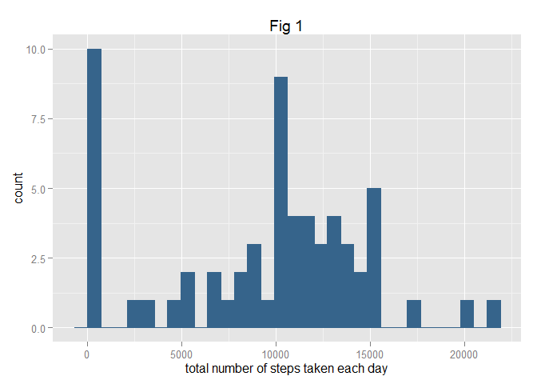
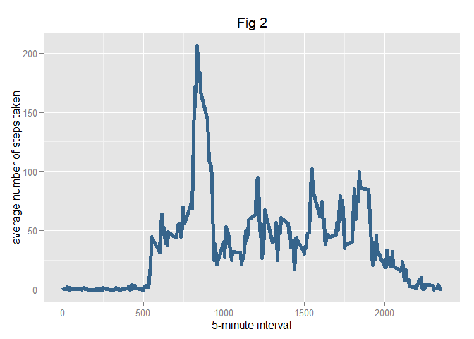
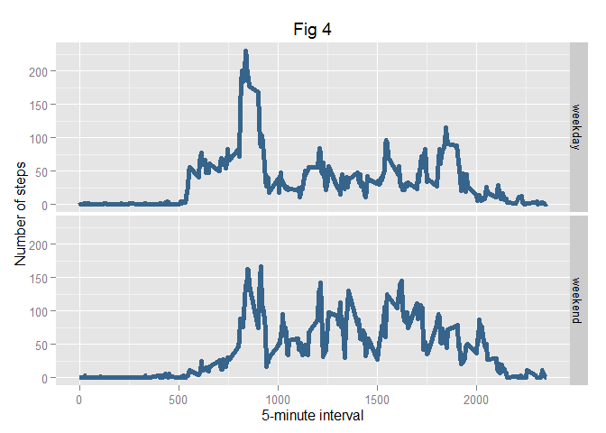

# Reproducible Research: Peer Assessment 1


## Loading and preprocessing the data
> Show any code that is needed to
>
> Load the data (i.e. read.csv())
> Process/transform the data (if necessary) into a format suitable for your analysis

The Activity data file is available in compressed ZIP format. 
Uncompress and read in R by running the following code. The data.table is used to read the data/


```r
setwd("C:/Users/SingTic 004/Desktop/repdata/")
library(data.table)
unzip(zipfile="activity.zip")
DT <- data.table(read.csv("activity.csv"))
```

## What is mean total number of steps taken per day?
> For this part of the assignment, you can ignore the missing values in the dataset.
> 
> Calculate the total number of steps taken per day
> 
> If you do not understand the difference between a histogram and a barplot, research the difference between them. Make a histogram of the total number of steps taken each day

Using the `data.table` data,  Apply tapply to the column named `steps` and sort it by `date`. Missing values are ignored. Then plot the histogram using qplot from the ggplot2 package. (Fig 1)


```r
library(ggplot2)
total.steps <- tapply(DT$steps, DT$date, FUN=sum, na.rm=TRUE)
qplot(total.steps, binwidth=3, xlab="total number of steps taken each day", main="Fig 1")+ geom_histogram(colour="steelblue4", fill="steelblue4")
```

```
## stat_bin: binwidth defaulted to range/30. Use 'binwidth = x' to adjust this.
```

 

```r
mean(total.steps, na.rm=TRUE)
```

```
## [1] 9354.23
```

```r
median(total.steps, na.rm=TRUE)
```

```
## [1] 10395
```

Average (Mean) number of steps per day is **9354.23**

The median number of steps per day is **10,395**

## What is the average daily activity pattern?
> Make a time series plot (i.e. type = "l") of the 5-minute interval (x-axis) and the average number of steps taken, averaged across all days (y-axis)

Time series plot of the 5-minute interval (x-axis) and the average number of steps taken, averaged across all days (y-axis) is shown in Fig 2.


```r
library(ggplot2)
averages <- aggregate(x=list(steps=DT$steps), by=list(interval=DT$interval), FUN=mean, na.rm=TRUE)
ggplot(data=averages, aes(x=interval, y=steps)) +geom_line(color = "steelblue4", lwd = 2) + xlab("5-minute interval") + ylab("average number of steps taken")+ labs(title = expression("Fig 2"))
```

 

On average across all the days in the dataset, the 5-minute interval contains
the maximum number of steps?

```r
averages[which.max(averages$steps),]
```

```
##     interval    steps
## 104      835 206.1698
```

The 5-minute interval that contains the maximum averaged number of steps is 8:35 am (**835**).  The maximum averaged number of steps is **206.1698**

## Imputing missing values
> Devise a strategy for filling in all of the missing values in the dataset. The strategy does not need to be sophisticated. For example, you could use the mean/median for that day, or the mean for that 5-minute interval, etc.

In the dataset, missing values are coded as `NA`. Missing values are found in many days/intervals. Missing values in days/intervals may introduce some bias in some calculations or summaries of the data.


```r
missing <- is.na(DT$steps)
# How many missing
table(missing)
```

```
## missing
## FALSE  TRUE 
## 15264  2304
```

> Create a new dataset that is equal to the original dataset but with the missing data filled in.

A new dataset is created with all of the missing values are filled in with mean value for that 5-minute interval.


```r
# Replace each missing value with the mean value of its 5-minute interval
fill.value <- function(steps, interval) {
    filled <- NA
    if (!is.na(steps))
        filled <- c(steps)
    else
        filled <- (averages[averages$interval==interval, "steps"])
    return(filled)
}
filled.DT <- DT
filled.DT$steps <- mapply(fill.value, filled.DT$steps, filled.DT$interval)
```
> Make a histogram of the total number of steps taken each day and Calculate and report the mean and median total number of steps taken per day.

Now, using the filled data set, a histogram of the total number of steps taken each day is plotted. The mean and median total number of steps is calculated. (Fig 3)


```r
total.steps <- tapply(filled.DT$steps, filled.DT$date, FUN=sum)
qplot(total.steps, binwidth=3, xlab="total number of steps taken each day", main="Fig 3") + geom_histogram(colour="steelblue4", fill="steelblue4")
```

```
## stat_bin: binwidth defaulted to range/30. Use 'binwidth = x' to adjust this.
```

 

```r
mean(total.steps)
```

```
## [1] 10766.19
```

```r
median(total.steps)
```

```
## [1] 10766.19
```

Average (Mean) number of steps per day is **10766.19**

The median number of steps per day is **10766.19**

From the new filled dataset, the mean and median values are higher as compared to the original dataset. In the original dataset, there are days with `steps` values `NA` for any `interval`. The total number of steps taken in such days are set to 0s by default. After replacing missing `steps` values with the mean `steps`
of associated `interval` value, these 0 values are removed from the histogram
of total number of steps taken each day.

## Are there differences in activity patterns between weekdays and weekends?
> For this part the weekdays() function may be of some help here. Use the dataset with the filled-in missing values for this part.
>
> Create a new factor variable in the dataset with two levels - "weekday" and "weekend" indicating whether a given date is a weekday or weekend day.

In this part, the dataset with the filled-in values is used. In order to find the day of the week for each measurement in the dataset, the following function is used.


```r
weekday.or.weekend <- function(date) {
    day <- weekdays(date)
    if (day %in% c("Monday", "Tuesday", "Wednesday", "Thursday", "Friday"))
        return("weekday")
    else if (day %in% c("Saturday", "Sunday"))
        return("weekend")
    else
        stop("invalid date")
}
filled.DT$date <- as.Date(filled.DT$date)
filled.DT$day <- sapply(filled.DT$date, FUN=weekday.or.weekend)
```

> Make a panel plot containing a time series plot (i.e. type = "l") of the 5-minute interval (x-axis) and the average number of steps taken, averaged across all weekday days or weekend days (y-axis). See the README file in the GitHub repository to see an example of what this plot should look like using simulated data.

Panel plot containing plots of average number of steps taken
on weekdays and weekends. (Fig 4)


```r
averages <- aggregate(steps ~ interval + day, data=filled.DT, mean)
ggplot(averages, aes(interval, steps)) + geom_line(color = "steelblue4", lwd = 2) + facet_grid(day ~ .) +
    xlab("5-minute interval") + ylab("Number of steps") + labs(title = expression("Fig 4"))
```

 
